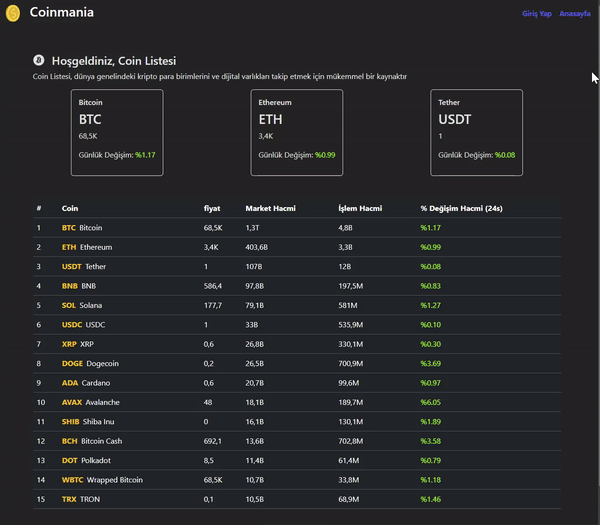

<h1>MVC PROJE COIN</h1>

Bu proje, kripto para birimlerini ve dijital varlıkları takip etmek için geliştirilmiş bir web uygulamasıdır. Bu uygulama, kullanıcılara kripto para birimlerinin anlık fiyatlarını, detaylarını, fiyat geçmişini ve grafiklerini sunar.

 <h2>Proje Amacı</h2>

Bu proje, kullanıcılara kripto para birimlerini ve dijital varlıkları kolayca takip etme imkanı sunmaktır. Kullanıcılar, uygulama üzerinden kripto para birimlerinin güncel fiyatlarını öğrenebilir, detaylı bilgilerini inceleyebilir ve fiyat geçmişini grafiklerle görsel olarak analiz edebilirler.

<h2> Özellikler </h2>

<ul>
<li>Kullanıcılar, ana sayfa üzerinde kripto para birimlerinin anlık fiyatlarını ve detaylarını görebilirler.</li>
<li>Kullanıcılar, kripto para birimlerinin detaylarına gitmek için ana sayfa üzerindeki kartlara tıklayabilirler.</li>
<li>Kullanıcılar, kripto para birimlerinin detaylarında bulunan grafikler aracılığıyla fiyat geçmişini inceleyebilirler.</li>
<li>Kullanıcılar, uygulamaya kayıt olarak veya giriş yaparak daha fazla özellikten faydalanabilirler.</li>
</ul>

<h2> Kullanılan Teknolojiler </h2>
<ul>
<li>bootstrap</li>
<li>formik</li>
<li>yup</li>
<li>react-router-dom</li>
<li>axios</li>
<li>chart.js</li>
<li>react-chartjs-2</li>
<li>react-icons/li>
<li>millify</li>
</ul>

<h2>Kaynak</h2>
API: https://docs.coincap.io/

<h2>Ekran Görüntüsü</h2>

